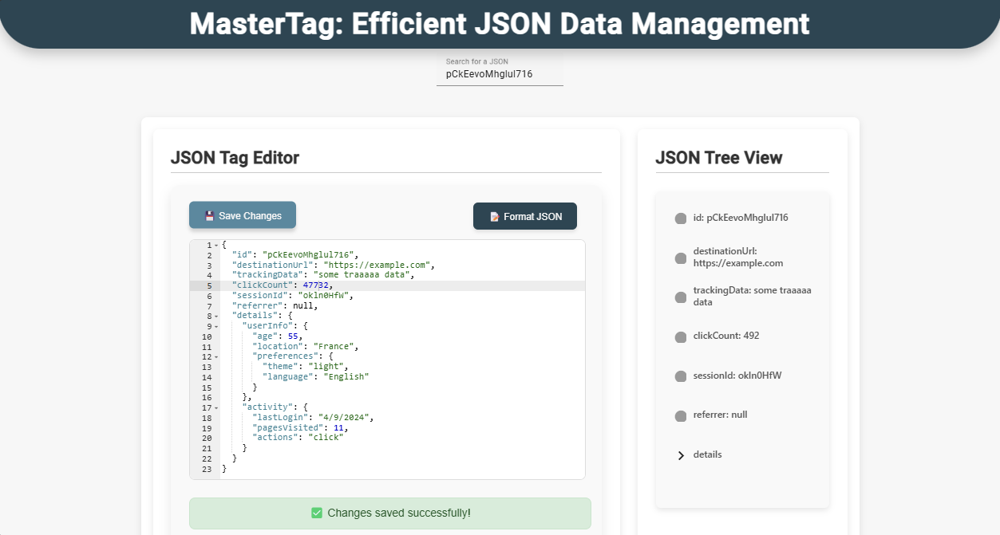

# MasterTagSystemInspiredByCriteo

## Description

MasterTagSystem is a real-time JSON data management and processing application, featuring a **C# (ASP.NET Core)** backend for storage and validation, an **Angular** for data visualization and editing, and **Kafka** for message streaming. The solution includes **MongoDB** for data storage and uses **SignalR** for real-time communication with the frontend.

<p align="center">
   
</p>

## Purpose

This project is a proactive initiative to enhance my application for the **Software Engineer Intern - Backend or Fullstack** position at **CRITEO**. I applied for this job on September 6, 2024, and I am currently in the 'interview in progress' status, having successfully passed the first two stages of the recruitment process. Although this project is not a requirement, it demonstrates my enthusiasm and commitment to joining **CRITEO**.

## User Interface

The interface is accessible at `http://localhost:4200`. Here are some screenshots of the interface:

<div style="display: flex; flex-wrap: wrap; gap: 10px;">
   
   
   
   
</div>

## Project Structure

- `backend/`: ASP.NET Core API, handling JSON data validation and storage.
- `frontend/`: Angular application for JSON data visualization and editing.
- `producerKafka/`: Python script for generating JSON messages, simulating a continuous data flow in Kafka.

## Quick Installation with Docker

The simplest way to start the application is to use Docker:

```bash
docker compose up --build
```

This command will build and start all necessary services (Backend, Frontend, Kafka, Zookeeper, MongoDB, Producer).

## Manual Installation (Alternative)

If you prefer a manual installation, here are the prerequisites and steps to follow:

### Prerequisites

- [.NET SDK](https://dotnet.microsoft.com/download)
- [Node.js and npm](https://nodejs.org/)
- [Kafka](https://kafka.apache.org/downloads) - Recommended version: **kafka_2.13-3.9.0**
- [MongoDB](https://www.mongodb.com/try/download/community) or [MongoDB Compass](https://www.mongodb.com/try/download/compass)
- [Python](https://www.python.org/downloads/) and `pip`

### Installation and Setup

### 1. Kafka

Download Kafka from the link above, then follow the steps below. Commands are provided for both PowerShell and WSL.

1. **Start Zookeeper:**
   - **PowerShell**: 
     ```powershell
     .\bin\windows\zookeeper-server-start.bat .\config\zookeeper.properties
     ```
   - **WSL**: 
     ```bash
     bin/zookeeper-server-start.sh config/zookeeper.properties
     ```

2. **Start Kafka:**
   - **PowerShell**: 
     ```powershell
     .\bin\windows\kafka-server-start .\config\server.properties
     ```
   - **WSL**: 
     ```bash
     bin/kafka-server-start.sh config/server.properties
     ```

3. **Create Kafka Topic:**
   - **PowerShell**: 
     ```powershell
     .\bin\windows\kafka-topics --create --topic json-requests --bootstrap-server localhost:9092
     ```
   - **WSL**: 
     ```bash
     bin/kafka-topics.sh --create --topic json-requests --bootstrap-server localhost:9092
     ```

### 2. MongoDB

Create a MongoDB database with a collection to store JSON data.

1. **Open MongoDB** (using MongoDB Compass or terminal):
   - Create a database named `CriteoProject`
   - Add a collection named `jsons` in this database

### 3. Backend (.NET Core)

1. **Navigate to the backend directory**:
   ```bash
   cd backend
   ```

2. **Build and run the backend**:
   ```bash
   dotnet build
   dotnet run
   ```
   The backend API will be accessible at `http://localhost:5000/api/tag/validate`.

### 4. Kafka Producer (Python Script)

1. **Create a virtual environment and install dependencies**:
   ```bash
   cd producerKafka
   python -m venv venv
   source venv/bin/activate  # On Windows, use venv\Scripts\activate
   pip install -r requirements.txt
   ```

2. **Run the script**:
   ```bash
   python producerKafka.py
   ```

This script automatically sends JSON messages to the backend via Kafka to populate the database.

### 5. Frontend (Angular)

1. **Navigate to the frontend directory**:
   ```bash
   cd frontend/frontend-app
   ```

2. **Install dependencies**:
   ```bash
   npm install
   ```

3. **Launch the frontend**:
   ```bash
   npm start
   ```
   The frontend will be accessible at `http://localhost:4200/`.

---

## Command Summary

| Step             | Command (PowerShell)                                                                                              | Command (WSL)                                           |
|------------------|--------------------------------------------------------------------------------------------------------------------|----------------------------------------------------------|
| Docker Installation | `docker compose up --build` | Same |
| Start Zookeeper  | `.\bin\windows\zookeeper-server-start.bat .\config\zookeeper.properties`                                          | `bin/zookeeper-server-start.sh config/zookeeper.properties` |
| Start Kafka      | `.\bin\windows\kafka-server-start.bat .\config\server.properties`                                                | `bin/kafka-server-start.sh config/server.properties`      |
| Create Kafka Topic | `.\bin\windows\kafka-topics.bat --create --topic json-requests --bootstrap-server localhost:9092`                 | `bin/kafka-topics.sh --create --topic json-requests --bootstrap-server localhost:9092` |
| Build and Start Backend | `dotnet build`, `dotnet run` | Same |
| Install Frontend Dependencies | `npm install` | Same |
| Start Frontend | `npm start` | Same |
| Run Python Script | `python producerKafka.py` | Same |

---

## Authors

Developed by **Samy Hadj-Said** as part of an application for a **Software Engineer Intern** position at **CRITEO**.
