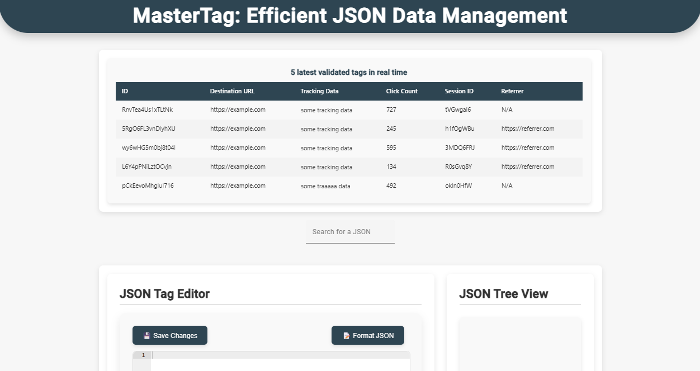
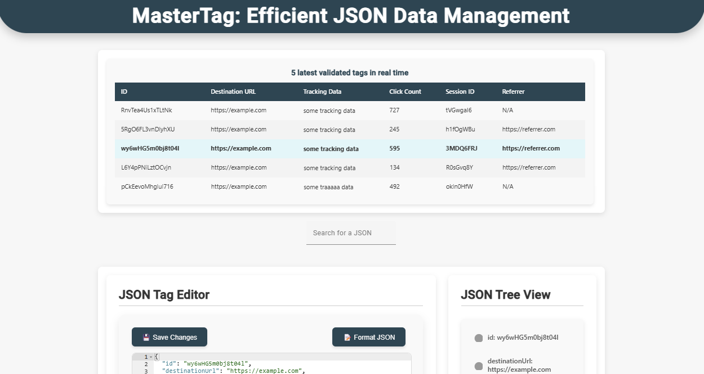
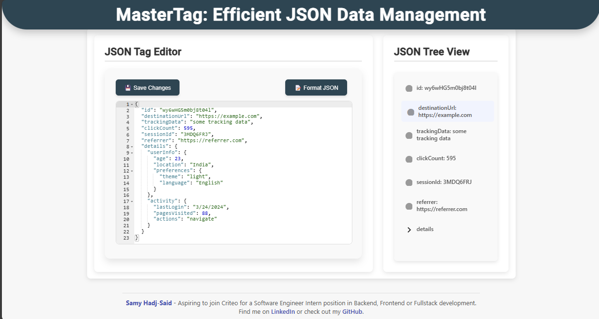
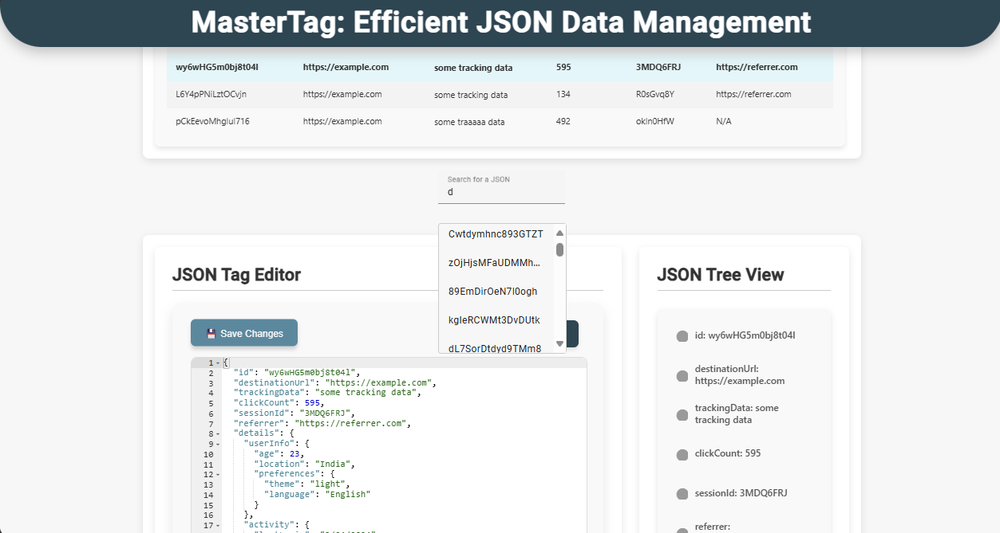

# MasterTagSystem

## Description

MasterTagSystem est une application de gestion et de traitement en temps réel de données JSON, avec un backend en C# (ASP.NET Core) pour le stockage et la validation, un frontend en Angular pour la visualisation et l'édition des données, et Kafka pour le streaming de messages. La solution inclut MongoDB pour le stockage des données et utilise SignalR pour la communication en temps réel avec le frontend.

## Interface Utilisateur

L'interface est accessible sur `http://localhost:4200`. Voici un aperçu des fonctionnalités :


*Vue principale du dashboard montrant le flux de données JSON en temps réel*


*Interface d'édition et de validation des données JSON*


*Vue principale du dashboard montrant le flux de données JSON en temps réel*


*Interface d'édition et de validation des données JSON*

## Structure du Projet

- `backend/` : API en ASP.NET Core, avec gestion de la validation et du stockage des données JSON.
- `frontend/` : Application Angular pour la visualisation et l'édition des données JSON.
- `producerKafka/` : Script Python pour la génération de messages JSON, simulant un flux continu de données dans Kafka.

## Installation Rapide avec Docker

La façon la plus simple de démarrer l'application est d'utiliser Docker :

```bash
docker compose up --build
```

Cette commande va construire et démarrer tous les services nécessaires (Backend, Frontend, Kafka, Zookeeper, MongoDB, Producer).

## Installation Manuelle (Alternative)

Si vous préférez une installation manuelle, voici les prérequis et les étapes à suivre :

### Prérequis

- [.NET SDK](https://dotnet.microsoft.com/download)
- [Node.js et npm](https://nodejs.org/)
- [Kafka](https://kafka.apache.org/downloads) - Version recommandée : **kafka_2.13-3.9.0**
- [MongoDB](https://www.mongodb.com/try/download/community) ou [MongoDB Compass](https://www.mongodb.com/try/download/compass)
- [Python](https://www.python.org/downloads/) et `pip`

### Installation et Exécution

### 1. Kafka

Téléchargez Kafka depuis le lien ci-dessus, puis suivez les étapes ci-dessous. Les commandes sont fournies pour PowerShell et WSL.

1. **Démarrer Zookeeper :**
   - **PowerShell** : 
     ```powershell
     .\bin\windows\zookeeper-server-start.bat .\config\zookeeper.properties
     ```
   - **WSL** : 
     ```bash
     bin/zookeeper-server-start.sh config/zookeeper.properties
     ```

2. **Démarrer Kafka :**
   - **PowerShell** : 
     ```powershell
     .\bin\windows\kafka-server-start.bat .\config\server.properties
     ```
   - **WSL** : 
     ```bash
     bin/kafka-server-start.sh config/server.properties
     ```

3. **Créer le topic Kafka :**
   - **PowerShell** : 
     ```powershell
     .\bin\windows\kafka-topics.bat --create --topic json-requests --bootstrap-server localhost:9092
     ```
   - **WSL** : 
     ```bash
     bin/kafka-topics.sh --create --topic json-requests --bootstrap-server localhost:9092
     ```

### 2. MongoDB

Créez une base de données MongoDB avec une collection pour stocker les données JSON.

1. **Ouvrir MongoDB** (avec MongoDB Compass ou via le terminal) :
   - Créez une base de données nommée `CriteoProject`.
   - Ajoutez une collection nommée `jsons` dans cette base de données.

### 3. Backend (.NET Core)

1. **Naviguer dans le répertoire du backend** :
   ```bash
   cd backend
   ```

2. **Construire et exécuter le backend** :
   ```bash
   dotnet build
   dotnet run
   ```
   L'API backend sera accessible sur `http://localhost:5000/api/tag/validate`.

### 4. Producer Kafka (Script Python)

1. **Créer un environnement virtuel et installer les dépendances** :
   ```bash
   cd producerKafka
   python -m venv venv
   source venv/bin/activate  # Sur Windows, utilisez venv\Scripts\activate
   pip install -r requirements.txt
   ```

2. **Exécuter le script** :
   ```bash
   python producerKafka.py
   ```

Ce script envoie automatiquement des messages JSON au backend via Kafka pour alimenter la base de données.

### 5. Frontend (Angular)

1. **Naviguer dans le répertoire du frontend** :
   ```bash
   cd frontend/frontend-app
   ```

2. **Installer les dépendances** :
   ```bash
   npm install
   ```

3. **Lancer le frontend** :
   ```bash
   npm start
   ```
   Le frontend sera accessible sur `http://localhost:4200/`.

---

## Résumé des Commandes

| Étape            | Commande (PowerShell)                                                                                              | Commande (WSL)                                           |
|------------------|--------------------------------------------------------------------------------------------------------------------|----------------------------------------------------------|
| Installation Docker | `docker compose up --build` | Idem |
| Démarrer Zookeeper  | `.\bin\windows\zookeeper-server-start.bat .\config\zookeeper.properties`                                          | `bin/zookeeper-server-start.sh config/zookeeper.properties` |
| Démarrer Kafka      | `.\bin\windows\kafka-server-start.bat .\config\server.properties`                                                | `bin/kafka-server-start.sh config/server.properties`      |
| Créer le topic Kafka | `.\bin\windows\kafka-topics.bat --create --topic json-requests --bootstrap-server localhost:9092`                 | `bin/kafka-topics.sh --create --topic json-requests --bootstrap-server localhost:9092` |
| Construire et démarrer le backend | `dotnet build`, `dotnet run` | Idem |
| Installer les dépendances frontend | `npm install` | Idem |
| Démarrer le frontend | `npm start` | Idem |
| Exécuter le script Python | `python producerKafka.py` | Idem |

---

## Auteurs

Développé par **Samy Hadj-Said** dans le cadre d'une candidature pour un poste de **Software Engineer Intern** chez Criteo.